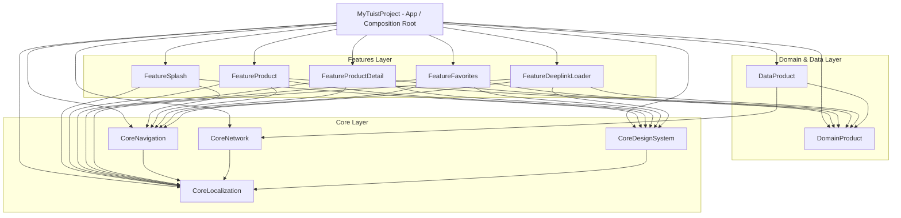

# 📱 MyTuistProject — Complete Architectural & Engineering Guide

Aplikasi iOS modern berbasis **SwiftUI** dan **Tuist** dengan penerapan **Modular Micro-Features Architecture**, **Clean Architecture**, **MVVM**, serta **Decoupled Navigation System**.

---

## 📑 Daftar Isi
1. [Overview & Tech Stack](#-overview--tech-stack)
2. [Panduan Lengkap Menggunakan Tuist (Daily Workflow)](#-panduan-lengkap-menggunakan-tuist-daily-workflow)
3. [Arsitektur Modular & Graf Dependensi](#-arsitektur-modular--graf-dependensi)
4. [Design Patterns & Prinsip Rekayasa](#-design-patterns--prinsip-rekayasa)
5. [Daftar Modul & Tanggung Jawab](#-daftar-modul--tanggung-jawab)
6. [Panduan Penggunaan (Usage Guide & Code Recipes)](#-panduan-penggunaan-usage-guide--code-recipes)
   - [A. Navigasi Antar Halaman (AppRouter)](#a-navigasi-antar-halaman-approuter)
   - [B. Menampilkan Sheet & Bottom Sheet](#b-menampilkan-sheet--bottom-sheet)
   - [C. Menampilkan Alert & Toast](#c-menampilkan-alert--toast)
   - [D. Manajemen Izin Perangkat (CorePermission)](#d-manajemen-izin-perangkat-corepermission)
   - [E. Dependency Injection (FactoryKit)](#e-dependency-injection-factorykit)
   - [F. Desain & Design Tokens](#f-desain--design-tokens)
   - [G. Lokalisasi & Multi-Language (CoreLocalization)](#g-lokalisasi--multi-language-corelocalization)
   - [H. Multi-Environment (Dev, UAT, Prod)](#h-multi-environment-dev-uat-prod)
   - [I. Logging Analytics Multi-Provider (CoreAnalytics)](#i-logging-analytics-multi-provider-coreanalytics)
   - [J. Networking Berbasis Moya + Combine (CoreNetwork)](#j-networking-berbasis-moya--combine-corenetwork)
7. [Alur Deep Link & Asynchronous Preload](#-alur-deep-link--asynchronous-preload)
8. [Panduan Menambah Komponen Baru (Step-by-Step)](#-panduan-menambah-komponen-baru-step-by-step)
   - [1. Menambah Fitur Baru (Feature Module)](#1-menambah-fitur-baru-feature-module)
   - [2. Menambah Endpoint & Repository (Data Layer)](#2-menambah-endpoint--repository-data-layer)
   - [3. Menambah Entity & UseCase (Domain Layer)](#3-menambah-entity--usecase-domain-layer)
   - [4. Menambah Deep Link Baru](#4-menambah-deep-link-baru)
9. [Testing & Mocking Strategy](#-testing--mocking-strategy)
10. [CLI & Tuist Cheat Sheet](#-cli--tuist-cheat-sheet)
11. [Troubleshooting & Gotchas](#-troubleshooting--gotchas)

---

## 🚀 Overview & Tech Stack

- **UI Framework**: SwiftUI (iOS 15.0+)
- **Minimum Deployment Target**: iOS 15.0
- **Build System & Project Generator**: [Tuist](https://tuist.io/)
- **Version & Tool Manager**: [mise](https://mise.jdx.dev/)
- **Dependency Injection**: [FactoryKit](https://github.com/hmlongco/Factory)
- **Networking**: [Moya](https://github.com/Moya/Moya) & [CombineMoya](https://github.com/Moya/Moya) (Reactive Network Layer)
- **Concurrency**: Swift Concurrency (`async`/`await`, `@MainActor`, `Sendable`)
- **Reactive State**: Combine (`@Published`, `ObservableObject`)
- **Testing**: XCTest

---

## 🛠 Panduan Lengkap Menggunakan Tuist (Daily Workflow)

Tuist adalah alat manajemen proyek Xcode berbasis deklarasi kode Swift yang mengeliminasi merge conflict `.xcodeproj` dan mempercepat proses build.

### 1. Struktur File Tuist di Project Ini
```
MyTuistProject/
  ├── Project.swift         # Manifest utama: deklarasi seluruh target, bundle ID, target framework, dan dependencies
  ├── Tuist.swift           # Konfigurasi global Tuist
  ├── Tuist/
  │    ├── Package.swift    # Deklarasi Swift Package Manager (misal: FactoryKit)
  │    └── Package.resolved # Lockfile versi library eksternal
  └── mise.toml             # Mengunci versi Tuist CLI (4.206.0)
```

> **Aturan Git:** File `*.xcodeproj`, `*.xcworkspace`, dan `Derived/` **tidak perlu di-commit** ke Git karena dapat digenerate kapan saja secara deterministik dari `Project.swift`.

---

### 2. Alur Penggunaan Sehari-hari (Daily Commands)

#### A. Install / Fetch External Dependencies (SPM)
Jika Anda baru melakukan `git clone` atau menambahkan paket baru di `Tuist/Package.swift`:
```bash
mise exec -- tuist install
```

#### B. Generate Xcode Project / Workspace
Untuk menghasilkan workspace dan membuka Xcode:
```bash
# Rekomendasi: Generate seluruh target dalam bentuk Source Code (tanpa binary cache)
mise exec -- tuist generate --cache-profile none

# Generate dan langsung buka Xcode otomatis
mise exec -- tuist generate --cache-profile none --open
```

#### C. Focus Mode (Bekerja Cepat pada 1 Fitur Tertentu)
Jika Anda hanya ingin fokus mengerjakan modul tertentu (misalnya `FeatureFavorites`) agar Xcode sangat ringan dan cepat:
```bash
mise exec -- tuist generate FeatureFavorites
```
*Tuist akan otomatis meng-generate source code `FeatureFavorites` dan mengganti modul lain dengan pre-compiled binary cache di background.*

#### D. Mengedit Konfigurasi Project (`tuist edit`)
Jangan mengedit `Project.swift` seperti file teks biasa jika ingin bantuan autocomplete & sintaks highlighting dari Xcode. Jalankan:
```bash
mise exec -- tuist edit
```
*Perintah ini membuka project Xcode sementara khusus untuk mengedit manifest `Project.swift` dan `Tuist/Package.swift` dengan auto-complete penuh.*

#### E. Menjalankan Unit Test Terisolasi
Anda dapat menjalankan unit test tanpa membuka simulator Xcode:
```bash
# Menjalankan test modul FeatureFavorites saja (sangat cepat ~1 detik)
mise exec -- tuist test FeatureFavorites

# Menjalankan test modul FeatureProduct
mise exec -- tuist test FeatureProduct

# Menjalankan seluruh test di semua modul
mise exec -- tuist test
```

#### F. Visualisasi Graf Arsitektur & Dependensi (`tuist graph`)
Untuk melihat diagram relasi dan dependensi antar modul dalam bentuk gambar PNG:
```bash
mise exec -- tuist graph --no-open -f png
```
*File `graph.png` akan dibuat di root folder proyek.*

#### G. Membersihkan Cache Tuist (`tuist clean`)
Jika terjadi ketidaksinkronan cache atau setelah update Xcode / tools:
```bash
mise exec -- tuist clean
mise exec -- tuist generate --cache-profile none
```

---

### 3. Cara Menambahkan Library Eksternal (SPM via Tuist)

1. Buka [Tuist/Package.swift](file:///Users/raditsan/MyData/Project/xcode-project/CobaTuist/MyTuistProject/Tuist/Package.swift).
2. Tambahkan paket di `dependencies`:
   ```swift
   dependencies: [
       .package(url: "https://github.com/hmlongco/Factory.git", from: "2.5.0"),
       .package(url: "https://github.com/onevcat/Kingfisher.git", from: "7.0.0") // Contoh baru
   ]
   ```
3. Unduh dependensi:
   ```bash
   mise exec -- tuist install
   ```
4. Tambahkan pada target yang membutuhkan di [Project.swift](file:///Users/raditsan/MyData/Project/xcode-project/CobaTuist/MyTuistProject/Project.swift):
   ```swift
   dependencies: [
       .external(name: "Kingfisher")
   ]
   ```
5. Generate ulang:
   ```bash
   mise exec -- tuist generate --cache-profile none
   ```

## 🏗 Arsitektur Modular & Graf Dependensi

Proyek ini menerapkan **Clean Architecture** berlapis yang dibagi ke dalam beberapa target framework terpisah:



### Aturan Dependensi (Dependency Rules):
1. **Domain Layer murni**: `DomainProduct` tidak memiliki dependensi ke layer Data atau UI/Feature mana pun.
2. **Feature saling terisolasi**: `FeatureProduct` **tidak boleh** mengimpor `FeatureProductDetail` atau `FeatureFavorites`. Komunikasi dan navigasi dilakukan melalui abstraksi route di `CoreNavigation`.
3. **Composition Root**: Hanya target `MyTuistProject` (App) yang mengetahui seluruh Feature, Data, dan Domain untuk merakit dependensi (`AppDIContainer`).

---

## 💎 Design Patterns & Prinsip Rekayasa

### 1. MVVM dengan Explicit ViewState
Setiap View dipasangkan dengan ViewModel `@MainActor` yang mengelola status berbasis enum:
```swift
public enum ViewState<T> {
    case idle
    case loading
    case success(T)
    case failure(String)
    case empty
}
```

### 2. Dependency Injection (FactoryKit)
Semua UseCase, Repository, API Client, dan Router didaftarkan ke `Container` FactoryKit. Injeksi dilakukan menggunakan `@Injected`:
```swift
@Injected(\.getProductsUseCase) private var getProductsUseCase
@Injected(\.router) private var router: AppRouter
```

### 3. Decoupled Navigation Pattern (Type-Safe Router)
Navigasi tidak menggunakan `NavigationLink` SwiftUI yang kaku, melainkan menggunakan `AppRouter` yang mendukung:
- Push / Pop / Pop to Root
- Pop ke destinasi tertentu (`popToDestination(.productList)`)
- Present Modal & Dynamic Sheet Detents (`.medium`, `.large`, `.fraction(0.4)`)
- Dynamic Alert & Toast Coordinator

### 4. Composition Root Pattern
Semua inisialisasi kongkret (Factory bindings dan View resolution) dilakukan di [AppDIContainer.swift](file:///Users/raditsan/MyData/Project/xcode-project/CobaTuist/MyTuistProject/MyTuistProject/Sources/CompositionRoot/AppDIContainer.swift), sehingga modul fitur tetap murni dan mudah ditest.

---

## 📦 Daftar Modul & Tanggung Jawab

| Target | Kategori | Tanggung Jawab |
|---|---|---|
| **`MyTuistProject`** | App | Composition root, bundle entry, `CFBundleURLSchemes`, pendaftaran view routing. |
| **`FeatureSplash`** | Presentation | Splash screen dengan transisi animasi awal menuju katalog. |
| **`FeatureProduct`** | Presentation | Katalog produk dengan horizontal filter kategori, search bar, dan kartu produk. |
| **`FeatureProductDetail`**| Presentation | Tampilan detail produk (gambar, harga, rating, deskripsi, tombol aksi). |
| **`FeatureFavorites`** | Presentation | Layar daftar produk favorit pengguna. |
| **`FeatureDeeplinkLoader`**| Presentation | Loading screen cerdas saat membuka link yang butuh fetch data terlebih dahulu. |
| **`DomainProduct`** | Domain | Entitas `Product`, `Category`, Use Cases (`GetProductsUseCase`, `GetProductDetailUseCase`), dan protokol `ProductRepository`. |
| **`DataProduct`** | Data | DTOs, `ProductRemoteDataSource` (DummyJSON REST API), `ProductRepositoryImpl`. |
| **`CoreNavigation`** | Core | Mesin navigasi (`AppRouter`, `AppRoute`, `SheetConfiguration`, `AlertCoordinator`, `ToastMessage`). |
| **`CoreDesignSystem`** | Core | Design tokens (`DesignTokens.Colors`, `Spacing`, `CornerRadius`, `Typography`) dan reusable UI (`LoadingView`, `ErrorView`, `ProductCardView`). |
| **`CoreNetwork`** | Core | Networking layer berbasis **Moya + Combine** (`CombineMoya`), abstraksi `TargetType` (`APIEndpoint`), reactive `AnyPublisher`, async/await bridge, dan deserializer JSON. |
| **`CoreLocalization`** | Core | Manajemen multi-bahasa (ID & EN), `LocalizationManager`, in-app language switching, strongly-typed `L10n`, dan resource `.strings`. |
| **`CorePermission`** | Core | Manajemen izin perangkat (Kamera, Lokasi, Notifikasi) dengan batch check & request via async/await dan FactoryKit. |
| **`CoreAnalytics`** | Core | Sistem analytics multi-provider (*Composite Pattern*) untuk logging event, screen view, user ID, dan user property dengan default `ConsoleAnalyticsProvider`. |

---

## 📖 Panduan Penggunaan (Usage Guide & Code Recipes)

### A. Navigasi Antar Halaman (`AppRouter`)

Injeksi router pada View atau ViewModel:
```swift
import CoreNavigation
import FactoryKit

struct ExampleView: View {
    @Injected(\.router) private var router

    var body: some View {
        Button("Lihat Detail") {
            // Push ke detail produk dengan objek Product
            router.navigate(.product(.detail(product)))
            
            // Atau navigasi ke menu favorit
            router.navigate(.favorites(.list))
        }
    }
}
```

**Perintah Navigasi Tersedia:**
```swift
router.navigate(.product(.detail(product)))  // Push halaman baru
router.pop()                                // Kembali 1 halaman
router.popToRoot()                          // Kembali ke halaman paling awal
router.popToDestination(.productList)       // Kembali ke halaman spesifik di stack
```

---

### B. Menampilkan Sheet & Bottom Sheet

Anda dapat menampilkan sheet dengan kustomisasi ukuran (*detents*):

```swift
// Menampilkan sheet dengan ukuran otomatis/medium
router.presentSheet(
    .product(.detail(product)),
    configuration: .init(detents: [.medium, .large], prefersGrabberVisible: true)
)

// Menutup sheet
router.dismissSheet()
```

---

### C. Menampilkan Alert & Toast

Gunakan `AlertCoordinator` dan `ToastMessage` yang sudah terintegrasi:

```swift
@Injected(\.alertCoordinator) private var alertCoordinator

// Menampilkan Alert
alertCoordinator.showAlert(
    title: "Konfirmasi",
    message: "Apakah Anda yakin ingin menghapus favorit?",
    primaryButtonText: "Hapus",
    primaryAction: { print("Dihapus") },
    secondaryButtonText: "Batal"
)

// Menampilkan Toast
alertCoordinator.showToast("Berhasil ditambahkan ke favorit!", type: .success)
```

---

### D. Manajemen Izin Perangkat (`CorePermission`)

Gunakan `permission` via FactoryKit untuk memeriksa atau meminta izin sistem secara async (single maupun batch):

```swift
import CorePermission
import FactoryKit

struct SampleView: View {
    @Injected(\.permission) private var permission

    func checkPermissions() async {
        // Batch check
        let result = await permission.check([.camera, .location, .notification])
        if result.allGranted {
            print("Semua izin diberikan!")
        }
    }

    func requestPermissions() async {
        // Batch request
        let result = await permission.request([.camera, .location, .notification])
        if result.isGranted(.camera) {
            print("Kamera diizinkan")
        }
    }
}
```

---

### E. Dependency Injection (FactoryKit)

#### 1. Mendaftarkan Dependency di Modul:
```swift
import FactoryKit

public extension Container {
    var getProductsUseCase: Factory<GetProductsUseCaseProtocol> {
        self { GetProductsUseCase() }.cached
    }
}
```

#### 2. Menggunakan Dependency di ViewModel:
```swift
@MainActor
public final class ProductListViewModel: ObservableObject {
    @Injected(\.getProductsUseCase) private var getProductsUseCase
    
    public func fetchProducts() async {
        do {
            let products = try await getProductsUseCase.execute(category: nil)
            // handle success
        } catch {
            // handle error
        }
    }
}
```

---

### E. Desain & Design Tokens

Gunakan standar token dari `CoreDesignSystem` untuk konsistensi UI dan dark mode:

```swift
import CoreDesignSystem

Text("Judul Produk")
    .font(DesignTokens.Typography.title)
    .foregroundColor(DesignTokens.Colors.textPrimary)
    .padding(DesignTokens.Spacing.md)
    .background(DesignTokens.Colors.cardBackground)
    .cornerRadius(DesignTokens.CornerRadius.md)
```

---

### F. Lokalisasi & Multi-Language (CoreLocalization)

Aplikasi mendukung lokalisasi dinamis untuk **Bahasa Indonesia (`id`)** dan **Bahasa Inggris (`en`)**.

#### 1. Mengakses String Terlokalisasi (`L10n` Auto-generated by Tuist):
`L10n` dibuat secara 100% otomatis oleh Tuist (`tuist generate`) melalui template custom `Tuist/ResourceSynthesizers/Strings.stencil`. Setiap string baru di `Localizable.strings` akan langsung menjadi strongly-typed property dengan dynamic computed property.

```swift
import CoreLocalization

// Namespace hierarkis dari key (contoh: product.catalog.title -> L10n.Product.Catalog.title)
let title = L10n.Product.Catalog.title
let retry = L10n.Common.retry
let profile = L10n.Profile.title // "Profil Saya" / "My Profile"

// String berargumen (parameterized)
let reviews = L10n.Product.Detail.reviewsCount(12) // ID: "(12 ulasan)" | EN: "(12 reviews)"
let errorDesc = L10n.Error.invalidResponse(404)
```

#### 2. Mengubah Bahasa Secara Dinamis (In-App Language Switching):
```swift
import CoreLocalization

// Via FactoryKit Dependency Injection:
@Injected(\.localizationManager) var localizationManager

// Ganti ke Bahasa Inggris
localizationManager.setLanguage(.english)

// Ganti ke Bahasa Indonesia
localizationManager.setLanguage(.indonesian)
```

#### 3. Otomatis Re-render melalui `AppRouter.addEnvironment`:
Seluruh tampilan yang dibuka melalui `AppRouter` (`navigate`, `setRootView`, `presentSheet`, `deeplinkLoader`) telah dibungkus oleh modifier:
```swift
private struct LocalizationObserverModifier: ViewModifier {
    @InjectedObject(\.localizationManager) private var localizationManager: LocalizationManager

    func body(content: Content) -> some View {
        content
            .environmentObject(localizationManager)
            .environment(\.locale, Locale(identifier: localizationManager.currentLanguage.rawValue))
            .id(localizationManager.currentLanguage)
    }
}
```
**Hasilnya:** View individual (seperti `FavoritesView`, `ProductDetailView`, dll.) **tidak perlu lagi menulis boilerplate `@ObservedObject`**. Seluruh hierarki UI otomatis di-render ulang ke bahasa baru saat `setLanguage(...)` dipanggil!

Jika sebuah View memerlukan kontrol perubahan bahasa (seperti menu pemilihan bahasa di `ProductListView`), cukup gunakan `@InjectedObject`:
```swift
struct LanguagePickerView: View {
    @InjectedObject(\.localizationManager) private var localizationManager: LocalizationManager

    var body: some View {
        Button("Switch to English") {
            localizationManager.setLanguage(.english)
        }
    }
}
```

---

### G. Multi-Environment (Dev, UAT, Prod)

Aplikasi mendukung 3 environment yang terisolasi menggunakan file `.xcconfig` dan skema Tuist terpisah:

| Environment | Scheme | App Name | Bundle ID | URL Scheme | Base URL |
|---|---|---|---|---|---|
| **Development** | `MyTuistProject-Dev` | `MyTuist (Dev)` | `dev.tuist.MyTuistProject.dev` | `mytuist-dev` | `https://fakestoreapi.com` |
| **UAT / Staging** | `MyTuistProject-UAT` | `MyTuist (UAT)` | `dev.tuist.MyTuistProject.uat` | `mytuist-uat` | `https://fakestoreapi.com` |
| **Production** | `MyTuistProject-Prod` | `MyTuist` | `dev.tuist.MyTuistProject` | `mytuist` | `https://fakestoreapi.com` |

#### 1. Mengakses Environment di Kode Swift (`CoreNetwork`):
```swift
import CoreNetwork

// Cek environment aktif
let currentEnv = AppEnvironment.current // .dev, .uat, atau .prod
let isProd = AppEnvironment.isProduction

// Mengakses Base URL dinamis
let url = AppEnvironment.baseURL
```

#### 2. Menjalankan / Build via CLI (CI/CD):
```bash
# Development
xcodebuild build -workspace MyTuistProject.xcworkspace -scheme MyTuistProject-Dev -destination "platform=iOS Simulator,name=iPhone 17"

# UAT / Staging
xcodebuild build -workspace MyTuistProject.xcworkspace -scheme MyTuistProject-UAT -destination "platform=iOS Simulator,name=iPhone 17"

# Production
xcodebuild build -workspace MyTuistProject.xcworkspace -scheme MyTuistProject-Prod -destination "platform=iOS Simulator,name=iPhone 17"
```

---

### I. Logging Analytics Multi-Provider (`CoreAnalytics`)

Modul `CoreAnalytics` mengadopsi pola **Composite Pattern**, di mana sebuah panggilan logging dapat didistribusikan ke berbagai analytics provider secara serentak. Secara bawaan, provider yang aktif adalah **`ConsoleAnalyticsProvider`** (mencetak output terstruktur ke console).

#### 1. Cara Penggunaan di ViewModel (Rekomendasi):
```swift
import Foundation
import CoreAnalytics
import FactoryKit

@MainActor
public final class ProductDetailViewModel: ObservableObject {
    @Injected(\.analytics) private var analytics

    public func onViewAppear() {
        // Logging screen view
        analytics.logScreenView(screenName: "ProductDetailView")
    }

    public func onAddToCartButtonTapped(product: Product) {
        // Menggunakan standard E-Commerce taxonomy
        analytics.logEvent(.addToCart(
            id: product.id,
            name: product.name,
            price: product.price,
            quantity: 1
        ))
    }

    public func onCheckoutCompleted(orderId: String, total: Double) {
        // Event pembelian standar GA4
        analytics.logEvent(.purchase(
            orderId: orderId,
            value: total,
            itemsCount: 1
        ))
    }

    public func handleFetchFailure(error: Error) {
        // Pelaporan error non-fatal ke analytics/APM
        analytics.recordError(error, additionalParameters: ["screen": "ProductDetail"])
    }
}
```

#### 2. Cara Deklaratif di SwiftUI View (`.trackScreen`):
Tidak perlu menulis boilerplate `.onAppear`:
```swift
import SwiftUI
import CoreAnalytics

struct ProductCatalogView: View {
    var body: some View {
        VStack {
            Text("Katalog Produk")
        }
        // Otomatis mencatat screen view & event saat halaman tampil
        .trackScreen("ProductCatalog", screenClass: "ProductCatalogView")
    }
}
```

#### 3. E-Commerce Standard Taxonomy (GA4 / Firebase Standard):
Tersedia helper static methods siap pakai di `AnalyticsEvent`:
```swift
// Lihat detail produk
analytics.logEvent(.viewItem(id: "101", name: "Sepatu Lari", price: 750000, category: "Shoes"))

// Lihat daftar kategori
analytics.logEvent(.viewItemList(category: "Shoes", itemsCount: 20))

// Keranjang belanja
analytics.logEvent(.addToCart(id: "101", name: "Sepatu Lari", price: 750000, quantity: 1))
analytics.logEvent(.removeFromCart(id: "101", name: "Sepatu Lari", price: 750000))

// Checkout & Transaksi
analytics.logEvent(.beginCheckout(value: 750000, itemsCount: 1))
analytics.logEvent(.purchase(orderId: "INV-2026-001", value: 750000, itemsCount: 1))

// Pencarian produk
analytics.logEvent(.search(query: "sepatu olahraga"))
```

#### 4. Global Common Metadata (Otomatis Disematkan):
Setiap event yang dikirim **secara otomatis disisipi metadata sistem** oleh interceptor `AnalyticsManager`:
- `platform`: `"iOS"`
- `os_version`: Versi iOS perangkat (misal `17.5`)
- `device_model`: Model perangkat (misal `iPhone 16,2`)
- `app_version` & `build_number`: Versi aplikasi dari Info.plist
- `environment`: `Dev`, `UAT`, atau `Prod`

Anda juga dapat menambahkan custom global parameters kapan saja:
```swift
// Menyematkan parameter global ke seluruh event berikutnya
analytics.setGlobalParameter(name: "user_tier", value: "platinum")
analytics.setGlobalParameter(name: "preferred_store_id", value: "STORE-JKT-01")
```

#### 5. Pelaporan Error Non-Fatal (`recordError`):
```swift
do {
    try await checkoutService.pay()
} catch {
    // Otomatis terdistribusi ke seluruh provider analytics / APM
    analytics.recordError(error, additionalParameters: [
        "step": "payment_gateway",
        "cart_total": 500000
    ])
}
```

#### 6. Manajemen User Identity & Logout:
```swift
import CoreAnalytics
import FactoryKit

final class AuthService {
    @Injected(\.analytics) private var analytics

    func didFinishLogin(userId: String) {
        // Ikat identitas user ke seluruh event yang akan datang
        analytics.setUserId(userId)

        // Set atribut profil user (User Properties)
        analytics.setUserProperty(name: "user_tier", value: "gold")
        analytics.setUserProperty(name: "gender", value: "female")
    }

    func didLogout() {
        // Bersihkan session dan user ID saat logout
        analytics.reset()
    }
}
```

#### 7. Contoh Log di Xcode Console:
```text
[Analytics - Console] 📊 Event: 'screen_view', Parameters: ["screen_name": "ProductCatalog", "platform": "iOS", "os_version": "26.2", "app_version": "1.0.0", "environment": "Dev"]
[Analytics - Console] 📊 Event: 'add_to_cart', Parameters: ["currency": "IDR", "item_id": "101", "item_name": "Sepatu Lari", "price": 750000.0, "quantity": 1, "platform": "iOS"]
[Analytics - Console] ❌ Error: 'Payment failed: Insufficient funds', Parameters: ["step": "payment_gateway", "platform": "iOS"]
[Analytics - Console] 👤 Set User ID: 'USR-8821'
[Analytics - Console] 🏷️ Set User Property: 'user_tier' = 'gold'
[Analytics - Console] 🔄 Reset Session
```

#### 8. Menambahkan Provider Baru di Masa Depan (Firebase, MoEngage, Dynatrace):
Anda **tidak perlu merombak kode di View/ViewModel**. Cukup:
1. Buat class baru yang mengadopsi `AnalyticsProviderProtocol`:
   ```swift
   import FirebaseAnalytics

   public final class FirebaseAnalyticsProvider: AnalyticsProviderProtocol {
       public let name = "Firebase"
       public var isEnabled = true

       public func logEvent(_ event: AnalyticsEvent) {
           Analytics.logEvent(event.name, parameters: event.parameters)
       }

       public func recordError(_ error: Error, additionalParameters: [String: Any]?) {
           // Contoh integrasi Crashlytics:
           // Crashlytics.crashlytics().record(error: error, userInfo: additionalParameters)
       }
       // implementasi initialize, setUserId, setUserProperty, reset...
   }
   ```
2. Daftarkan di `Container+Analytics.swift`:
   ```swift
   AnalyticsManager(providers: [
       ConsoleAnalyticsProvider(),
       FirebaseAnalyticsProvider()
   ])
   ```

---

### J. Networking Berbasis Moya + Combine (`CoreNetwork`)

Modul `CoreNetwork` menggunakan arsitektur modular berbasis **Moya** native `PluginType` yang dikombinasikan dengan framework reaktif **Combine** (`CombineMoya`), serta menyediakan jembatan *backward-compatible* untuk Swift Concurrency (`async`/`await`).

```
Core/Network/Sources/
├── Client/
│   ├── NetworkClient.swift          # MoyaNetworkClient + Protocol + Shared Session
│   ├── Publisher+Retry.swift        # Smart retry dengan backoff delay
│   └── Container+Network.swift      # Factory DI wiring (networkPlugins, networkClient)
├── Configuration/
│   ├── AppEnvironment.swift         # Dev/UAT/Prod detection
│   └── NetworkConfiguration.swift   # Timeout, RetryPolicy, LogLevel
├── Models/
│   ├── APIEndpoint.swift            # TargetType typealias
│   ├── EmptyResponse.swift          # Model 204 No Content / Empty body
│   ├── HTTPMethod.swift             # Moya.Method typealias
│   └── NetworkError.swift           # Mapped errors + Backend error body parsing (apiError)
└── Plugins/
    ├── HeaderPlugin.swift           # Injeksi metadata aplikasi (X-Platform, X-App-Version, dll.)
    ├── AuthPlugin.swift             # Injeksi Bearer token via TokenProvider
    ├── LoggingPlugin.swift          # Logging konsol berdasarkan LogLevel
    ├── ErrorPlugin.swift            # Global error handler (misal auto-logout pada 401)
    └── RetryPlugin.swift            # Konversi status 50x agar diulang oleh Combine
```

#### 1. Mendefinisikan Endpoint (`TargetType`):
Setiap endpoint API diimplementasikan sebagai enum yang mengadopsi `TargetType`:
```swift
import Foundation
import CoreNetwork
import Moya

public enum ProductEndpoint: TargetType {
    case getProducts
    case getProductDetail(id: Int)
    case deleteProduct(id: Int)

    public var baseURL: URL {
        URL(string: AppEnvironment.baseURL)!
    }

    public var path: String {
        switch self {
        case .getProducts: return "/products"
        case .getProductDetail(let id): return "/products/\(id)"
        case .deleteProduct(let id): return "/products/\(id)"
        }
    }

    public var method: Moya.Method {
        switch self {
        case .getProducts, .getProductDetail: return .get
        case .deleteProduct: return .delete
        }
    }

    public var task: Task {
        .requestPlain
    }

    public var headers: [String: String]? {
        defaultHeaders // ["Content-Type": "application/json", "Accept": "application/json"]
    }
}
```

#### 2. Melakukan Request Menggunakan Combine (`AnyPublisher`):
```swift
import Combine
import CoreNetwork
import FactoryKit

final class ProductService {
    @Injected(\.networkClient) private var client: NetworkClientProtocol
    private var cancellables: Set<AnyCancellable> = []

    func fetchProductsPublisher() {
        client.request(target: ProductEndpoint.getProducts, type: [ProductDTO].self)
            .sink(
                receiveCompletion: { completion in
                    if case .failure(let error) = completion {
                        print("Error: \(error.localizedDescription)")
                    }
                },
                receiveValue: { products in
                    print("Diterima: \(products.count) produk")
                }
            )
            .store(in: &cancellables)
    }
}
```

#### 3. Melakukan Request Menggunakan `async/await`:
`MoyaNetworkClient` secara transparan menyediakan jembatan async/await lengkap dengan cooperative Task cancellation:
```swift
@Injected(\.networkClient) private var client: NetworkClientProtocol

// Request dengan decoding model:
func loadProducts() async throws -> [ProductDTO] {
    try await client.request(target: ProductEndpoint.getProducts, type: [ProductDTO].self)
}

// Request tanpa return body (Void / 204 No Content):
func deleteProduct(id: Int) async throws {
    try await client.request(target: ProductEndpoint.deleteProduct(id: id))
}
```

#### 4. Menangani Pesan Error Spesifik dari Backend:
Jika server mengembalikan HTTP 400/422 dengan pesan JSON, `NetworkError` otomatis mengekstraknya sebagai `.apiError`:
```swift
do {
    let products = try await client.request(target: ProductEndpoint.getProducts, type: [ProductDTO].self)
} catch let error as NetworkError {
    // Menampilkan pesan langsung dari backend (misal: "Email sudah terdaftar"):
    print(error.localizedDescription)

    // Atau decode payload error terstruktur spesifik jika ada:
    if let customError = error.parseErrorBody(type: CustomApiError.self) {
        print("Code: \(customError.code)")
    }
}
```

---

## ⚡ Alur Deep Link & Asynchronous Preload

Aplikasi mendukung dua jenis deeplink:
1. **Direct Navigation**: Langsung membuka halaman target jika data lokal / parameter ID cukup.
2. **Preload Navigation (FeatureDeeplinkLoader)**: Membuka layar loading transisi untuk memanggil API terlebih dahulu, memastikan data lengkap sebelum halaman tujuan dirender.

```
URL Scheme: mytuist://product-preload/10
                     │
                     ▼
          DeepLinkHandler.parse()
                     │
                     ▼
       AppRoute.deeplinkFetch(.product(id: 10))
                     │
                     ▼
           DeeplinkLoaderView
        (Menampilkan animasi loader)
                     │
     ┌───────────────┴───────────────┐
     │ Hit GetProductDetailUseCase   │
     │   (Memuat data produk ID 10)  │
     └───────────────┬───────────────┘
                     │
                     ▼ (Sukses)
    router.replaceRoot(.product(.detail(product)))
```

### URL Schemes & Parameter yang Didukung:
- **Katalog Produk**:
  - `mytuist://product` atau `mytuist://products`
- **Detail Produk Langsung (Direct)**:
  - Query parameter: `mytuist://product?id=5` atau `mytuist://product/detail?id=5`
  - Path parameter: `mytuist://product/5`
- **Preload Produk (Loader Screen)**:
  - Query parameter: `mytuist://product?id=5&preload=true` atau `mytuist://product?preload=5`
  - Path + Query: `mytuist://product/preload?id=5`
  - Path parameter: `mytuist://product/preload/5` atau `mytuist://product-preload/5`
- **Halaman Favorit**:
  - `mytuist://favorites` atau `mytuist://favorite`
- **Splash Screen**:
  - `mytuist://splash`

---

## 🛠 Panduan Menambah Komponen Baru (Otomatis & Manual)

### ⚡ Otomatis Menggunakan Makefile (Direkomendasikan)

Tersedia perintah otomasi cepat untuk membuat Feature baru atau menambahkan Screen baru:

```bash
# 1. Menampilkan menu bantuan
make help

# 2. Membuat Feature Module baru lengkap:
make feature name=Cart
# Atau jalankan tanpa argumen untuk mode interaktif:
make feature

# 3. Menambahkan Screen baru ke Feature yang sudah ada:
make screen feature=Cart name=Checkout
# Atau jalankan tanpa argumen untuk memilih feature & screen interaktif:
make screen
```

Perintah di atas secara otomatis akan:
- Membuat direktori & file View, ViewModel, dan ViewModelTests.
- Membuat Navigation Param (`<Screen>ScreenParam`) di `CoreNavigation` tanpa dependensi ke domain.
- Mendaftarkan Destination (`<Feature>Destination`) dan Route (`<Feature>Route`).
- Mendaftarkan ke `AppRoute`, `AppRouteDestination`, dan `DeepLinkHandler`.
- Membuat/memperbarui `<Feature>RouteHandler` dan registrasi di `AppDIContainer`.
- Mendaftarkan target di `Project.swift` (untuk feature baru).
- Menjalankan `tuist generate --no-open` secara otomatis.

---

### 📖 Panduan Manual (Step-by-Step)

### 1. Menambah Fitur Baru (Feature Module)
Misal membuat fitur keranjang belanja: `FeatureCart`.

#### Langkah 1.1: Buat Struktur File
```
Features/Cart/
  ├── Sources/
  │    ├── ViewModels/CartViewModel.swift
  │    └── Views/CartView.swift
  └── Tests/
       └── CartViewModelTests.swift
```

#### Langkah 1.2: Daftarkan Target di `Project.swift`
```swift
// Di dalam targets array pada Project.swift
.target(
    name: "FeatureCart",
    destinations: .iOS,
    product: .framework,
    bundleId: "dev.tuist.FeatureCart",
    sources: ["Features/Cart/Sources/**"],
    dependencies: [
        .external(name: "FactoryKit"),
        .target(name: "CoreDesignSystem"),
        .target(name: "CoreNavigation"),
        .target(name: "DomainProduct"),
    ]
),
.target(
    name: "FeatureCartTests",
    destinations: .iOS,
    product: .unitTests,
    bundleId: "dev.tuist.FeatureCartTests",
    infoPlist: .default,
    sources: ["Features/Cart/Tests/**"],
    dependencies: [
        .target(name: "FeatureCart"),
        .external(name: "FactoryKit")
    ]
),
```
*Pastikan menambahkan `.target(name: "FeatureCart")` pada dependencies target utama `MyTuistProject`.*

#### Langkah 1.3: Buat Routing di `CoreNavigation`
1. Tambahkan `CartDestination.swift` di `Core/Navigation/Sources/Destinations/`:
   ```swift
   public enum CartDestination: FeatureDestination {
       case cartList
   }
   ```
2. Tambahkan `CartRoute.swift` di `Core/Navigation/Sources/Routes/`:
   ```swift
   public enum CartRoute: AppRouteType {
       case cartList
       public var destination: AppRouteDestination { .cart(.cartList) }
       @MainActor @ViewBuilder public func makeView() -> some View {
           AppRouter.viewBuilder(.cart(self))
       }
   }
   ```
3. Tambahkan `.cart(CartRoute)` di `AppRoute.swift` dan `.cart(CartDestination)` di `AppRouteDestination.swift`.

#### Langkah 1.4: Buat Route Handler di `MyTuistProject/Sources/CompositionRoot/Routes/CartRouteHandler.swift`
```swift
import SwiftUI
import CoreNavigation
import FeatureCart

@MainActor
public struct CartRouteHandler {
    public static func buildView(for route: CartRoute) -> AnyView {
        @ViewBuilder
        var view: some View {
            switch route {
            case .cartList:
                CartView()
            }
        }
        return AnyView(view)
    }
}
```

Dan hubungkan di [AppDIContainer.swift](file:///Users/raditsan/MyData/Project/xcode-project/CobaTuist/MyTuistProject/MyTuistProject/Sources/CompositionRoot/AppDIContainer.swift):
```swift
// Di dalam setupNavigation():
case .cart(let cartRoute):
    return CartRouteHandler.buildView(for: cartRoute)
```

---

### 2. Menambah Endpoint & Repository (Data Layer)

1. Tambahkan DTO model di `Modules/Data/Product/Sources/DTOs/`.
2. Tambahkan method di `ProductRemoteDataSource.swift`:
   ```swift
   public func fetchCartItems() async throws -> [CartItemDTO] {
       let endpoint = Endpoint(path: "/carts/user/1")
       return try await apiClient.request(endpoint)
   }
   ```
3. Implementasikan fungsi tersebut pada `ProductRepositoryImpl.swift`.

---

### 3. Menambah Entity & UseCase (Domain Layer)

1. Definisikan Entity di `Modules/Domain/Product/Sources/Entities/`.
2. Definisikan protokol UseCase dan implementasinya di `Modules/Domain/Product/Sources/UseCases/`:
   ```swift
   public protocol GetCartUseCaseProtocol: Sendable {
       func execute() async throws -> [CartItem]
   }

   public final class GetCartUseCase: GetCartUseCaseProtocol {
       @Injected(\.productRepository) private var repository
       public init() {}
       public func execute() async throws -> [CartItem] {
           try await repository.getCart()
       }
   }
   ```
3. Daftarkan di `Container+Domain.swift` agar bisa diinjeksi via `@Injected(\.getCartUseCase)`.

---

### 4. Menambah Deep Link Baru

Deep link ditangani secara terdesentralisasi langsung pada rute fiturnya masing-masing (`CartRoute.swift`), bukan di `AppRoute.swift`:

1. Implementasikan `deepLinkResolve` di `Core/Navigation/Sources/Routes/CartRoute.swift` (mendukung path dan query parameter):
```swift
public enum CartRoute: AppRouteType {
    case cartList
    
    public static var deepLinkHost: String? { "cart" }

    public static func deepLinkResolve(
        pathComponents: [String],
        queryParameters: [String: String] = [:]
    ) -> AppRoute? {
        let host = pathComponents.first ?? ""
        guard host == deepLinkHost || host == "carts" else { return nil }
        return .cart(.cartList)
    }
}
```

2. Daftarkan tipe rute baru ke [DeepLinkHandler.swift](file:///Users/raditsan/MyData/Project/xcode-project/CobaTuist/MyTuistProject/Core/Navigation/Sources/DeepLinkHandler.swift):
```swift
// Di dalam DeepLinkHandler.swift:
public private(set) static var registeredRoutes: [any AppRouteType.Type] = [
    ProductRoute.self,
    FavoritesRoute.self,
    CartRoute.self,
    AppRoute.self
]

// Atau didaftarkan secara dinamis:
DeepLinkHandler.register(CartRoute.self)
```
Sekarang `mytuist://cart` akan otomatis diurai dan diarahkan ke halaman keranjang!

---

## 🧪 Testing & Mocking Strategy

Pengujian dilakukan secara terisolasi tanpa memerlukan simulator berjalan (Unit Testing cepat):

### Pola Mocking dengan FactoryKit
```swift
import XCTest
import FactoryKit
@testable import FeatureProduct
@testable import DomainProduct

final class ProductListViewModelTests: XCTestCase {
    override func setUp() {
        super.setUp()
        Container.shared.reset()
        
        // Mocking UseCase
        Container.shared.getProductsUseCase.register {
            MockGetProductsUseCase(stubbedProducts: [.mock()])
        }
    }
    
    @MainActor
    func test_fetchProducts_success() async {
        let sut = ProductListViewModel()
        await sut.onAppear()
        XCTAssertEqual(sut.products.count, 1)
    }
}
```

---

## 💻 CLI & Tuist Cheat Sheet

| Perintah | Deskripsi |
|---|---|
| `mise exec -- tuist generate --cache-profile none` | Generate Xcode workspace lengkap dengan seluruh target source code. |
| `mise exec -- tuist test` | Menjalankan seluruh unit test di semua modul. |
| `mise exec -- tuist test FeatureFavorites` | Menjalankan unit test khusus target `FeatureFavorites`. |
| `mise exec -- tuist test FeatureProduct` | Menjalankan unit test khusus target `FeatureProduct`. |
| `mise exec -- tuist edit` | Membuka project manifest (`Project.swift`) di Xcode sementara untuk diedit. |
| `xcrun simctl openurl booted "mytuist://favorites"` | Mengirim URL deep link ke simulator yang sedang aktif. |

---

## ⚠️ Troubleshooting & Gotchas

#### 1. Target atau Scheme di Xcode Hilang / Berkurang
- **Penyebab**: Menjalankan `tuist test <Target>` membuat Tuist mengaktifkan mode *Binary Caching / Focus*, sehingga target lain diganti pre-compiled binary.
- **Solusi**: Jalankan perintah berikut untuk mengembalikan seluruh target:
  ```bash
  mise exec -- tuist generate --cache-profile none
  ```

#### 2. Circular Dependency Antar Feature
- **Penyebab**: Mencoba meng-import `FeatureProductDetail` di dalam `FeatureProduct`.
- **Solusi**: Jangan pernah import sesama Feature. Gunakan `router.navigate(.product(.detail(id: item.id)))` via `CoreNavigation`.

#### 3. Error Deep Link NSOSStatusErrorDomain -10814
- **Penyebab**: Simulator belum pernah meng-install / menjalankan aplikasi dengan `CFBundleURLSchemes` terdaftar.
- **Solusi**: Build & Run aplikasi minimal 1 kali di Simulator sebelum menjalankan `xcrun simctl openurl booted`.

---

✨ *Dikelola dan dikembangkan dengan standar modularitas tinggi untuk skalabilitas maksimal.*
