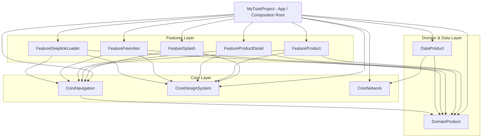

# 📱 MyTuistProject — Complete Architectural & Engineering Guide

Aplikasi iOS modern berbasis **SwiftUI** dan **Tuist** dengan penerapan **Modular Micro-Features Architecture**, **Clean Architecture**, **MVVM**, serta **Decoupled Navigation System**.

---

## 📑 Daftar Isi
1. [Overview & Tech Stack](#-overview--tech-stack)
2. [Panduan Lengkap Menggunakan Tuist (Daily Workflow)](#-panduan-lengkap-menggunakan-tuist-daily-workflow)
3. [Arsitektur Modular & Graf Dependensi](#-arsitektur-modular--graf-dependensi)
4. [Design Patterns & Prinsip Rekayasa](#-design-patterns--prinsip-rekayasa)
5. [Daftar Modul & Tanggung Jawab](#-daftar-modul--tanggung-jawab)
6. [Panduan Penggunaan (Usage Guide & Code Recipes)](#-panduan-penggunaan-usage-guide--code-recipes)
   - [A. Navigasi Antar Halaman (AppRouter)](#a-navigasi-antar-halaman-approuter)
   - [B. Menampilkan Sheet & Bottom Sheet](#b-menampilkan-sheet--bottom-sheet)
   - [C. Menampilkan Alert & Toast](#c-menampilkan-alert--toast)
   - [D. Dependency Injection (FactoryKit)](#d-dependency-injection-factorykit)
   - [E. Desain & Design Tokens](#e-desain--design-tokens)
7. [Alur Deep Link & Asynchronous Preload](#-alur-deep-link--asynchronous-preload)
8. [Panduan Menambah Komponen Baru (Step-by-Step)](#-panduan-menambah-komponen-baru-step-by-step)
   - [1. Menambah Fitur Baru (Feature Module)](#1-menambah-fitur-baru-feature-module)
   - [2. Menambah Endpoint & Repository (Data Layer)](#2-menambah-endpoint--repository-data-layer)
   - [3. Menambah Entity & UseCase (Domain Layer)](#3-menambah-entity--usecase-domain-layer)
   - [4. Menambah Deep Link Baru](#4-menambah-deep-link-baru)
9. [Testing & Mocking Strategy](#-testing--mocking-strategy)
10. [CLI & Tuist Cheat Sheet](#-cli--tuist-cheat-sheet)
11. [Troubleshooting & Gotchas](#-troubleshooting--gotchas)

---

## 🚀 Overview & Tech Stack

- **UI Framework**: SwiftUI (iOS 15.0+)
- **Minimum Deployment Target**: iOS 15.0
- **Build System & Project Generator**: [Tuist](https://tuist.io/)
- **Version & Tool Manager**: [mise](https://mise.jdx.dev/)
- **Dependency Injection**: [FactoryKit](https://github.com/hmlongco/Factory)
- **Concurrency**: Swift Concurrency (`async`/`await`, `@MainActor`, `Sendable`)
- **Reactive State**: Combine (`@Published`, `ObservableObject`)
- **Testing**: XCTest

---

## 🛠 Panduan Lengkap Menggunakan Tuist (Daily Workflow)

Tuist adalah alat manajemen proyek Xcode berbasis deklarasi kode Swift yang mengeliminasi merge conflict `.xcodeproj` dan mempercepat proses build.

### 1. Struktur File Tuist di Project Ini
```
MyTuistProject/
  ├── Project.swift         # Manifest utama: deklarasi seluruh target, bundle ID, target framework, dan dependencies
  ├── Tuist.swift           # Konfigurasi global Tuist
  ├── Tuist/
  │    ├── Package.swift    # Deklarasi Swift Package Manager (misal: FactoryKit)
  │    └── Package.resolved # Lockfile versi library eksternal
  └── mise.toml             # Mengunci versi Tuist CLI (4.206.0)
```

> **Aturan Git:** File `*.xcodeproj`, `*.xcworkspace`, dan `Derived/` **tidak perlu di-commit** ke Git karena dapat digenerate kapan saja secara deterministik dari `Project.swift`.

---

### 2. Alur Penggunaan Sehari-hari (Daily Commands)

#### A. Install / Fetch External Dependencies (SPM)
Jika Anda baru melakukan `git clone` atau menambahkan paket baru di `Tuist/Package.swift`:
```bash
mise exec -- tuist install
```

#### B. Generate Xcode Project / Workspace
Untuk menghasilkan workspace dan membuka Xcode:
```bash
# Rekomendasi: Generate seluruh target dalam bentuk Source Code (tanpa binary cache)
mise exec -- tuist generate --cache-profile none

# Generate dan langsung buka Xcode otomatis
mise exec -- tuist generate --cache-profile none --open
```

#### C. Focus Mode (Bekerja Cepat pada 1 Fitur Tertentu)
Jika Anda hanya ingin fokus mengerjakan modul tertentu (misalnya `FeatureFavorites`) agar Xcode sangat ringan dan cepat:
```bash
mise exec -- tuist generate FeatureFavorites
```
*Tuist akan otomatis meng-generate source code `FeatureFavorites` dan mengganti modul lain dengan pre-compiled binary cache di background.*

#### D. Mengedit Konfigurasi Project (`tuist edit`)
Jangan mengedit `Project.swift` seperti file teks biasa jika ingin bantuan autocomplete & sintaks highlighting dari Xcode. Jalankan:
```bash
mise exec -- tuist edit
```
*Perintah ini membuka project Xcode sementara khusus untuk mengedit manifest `Project.swift` dan `Tuist/Package.swift` dengan auto-complete penuh.*

#### E. Menjalankan Unit Test Terisolasi
Anda dapat menjalankan unit test tanpa membuka simulator Xcode:
```bash
# Menjalankan test modul FeatureFavorites saja (sangat cepat ~1 detik)
mise exec -- tuist test FeatureFavorites

# Menjalankan test modul FeatureProduct
mise exec -- tuist test FeatureProduct

# Menjalankan seluruh test di semua modul
mise exec -- tuist test
```

#### F. Visualisasi Graf Arsitektur & Dependensi (`tuist graph`)
Untuk melihat diagram relasi dan dependensi antar modul dalam bentuk gambar PNG:
```bash
mise exec -- tuist graph --no-open -f png
```
*File `graph.png` akan dibuat di root folder proyek.*

#### G. Membersihkan Cache Tuist (`tuist clean`)
Jika terjadi ketidaksinkronan cache atau setelah update Xcode / tools:
```bash
mise exec -- tuist clean
mise exec -- tuist generate --cache-profile none
```

---

### 3. Cara Menambahkan Library Eksternal (SPM via Tuist)

1. Buka [Tuist/Package.swift](file:///Users/raditsan/MyData/Project/xcode-project/CobaTuist/MyTuistProject/Tuist/Package.swift).
2. Tambahkan paket di `dependencies`:
   ```swift
   dependencies: [
       .package(url: "https://github.com/hmlongco/Factory.git", from: "2.5.0"),
       .package(url: "https://github.com/onevcat/Kingfisher.git", from: "7.0.0") // Contoh baru
   ]
   ```
3. Unduh dependensi:
   ```bash
   mise exec -- tuist install
   ```
4. Tambahkan pada target yang membutuhkan di [Project.swift](file:///Users/raditsan/MyData/Project/xcode-project/CobaTuist/MyTuistProject/Project.swift):
   ```swift
   dependencies: [
       .external(name: "Kingfisher")
   ]
   ```
5. Generate ulang:
   ```bash
   mise exec -- tuist generate --cache-profile none
   ```

## 🏗 Arsitektur Modular & Graf Dependensi

Proyek ini menerapkan **Clean Architecture** berlapis yang dibagi ke dalam beberapa target framework terpisah:



### Aturan Dependensi (Dependency Rules):
1. **Domain Layer murni**: `DomainProduct` tidak memiliki dependensi ke layer Data atau UI/Feature mana pun.
2. **Feature saling terisolasi**: `FeatureProduct` **tidak boleh** mengimpor `FeatureProductDetail` atau `FeatureFavorites`. Komunikasi dan navigasi dilakukan melalui abstraksi route di `CoreNavigation`.
3. **Composition Root**: Hanya target `MyTuistProject` (App) yang mengetahui seluruh Feature, Data, dan Domain untuk merakit dependensi (`AppDIContainer`).

---

## 💎 Design Patterns & Prinsip Rekayasa

### 1. MVVM dengan Explicit ViewState
Setiap View dipasangkan dengan ViewModel `@MainActor` yang mengelola status berbasis enum:
```swift
public enum ViewState<T> {
    case idle
    case loading
    case success(T)
    case failure(String)
    case empty
}
```

### 2. Dependency Injection (FactoryKit)
Semua UseCase, Repository, API Client, dan Router didaftarkan ke `Container` FactoryKit. Injeksi dilakukan menggunakan `@Injected`:
```swift
@Injected(\.getProductsUseCase) private var getProductsUseCase
@Injected(\.router) private var router: AppRouter
```

### 3. Decoupled Navigation Pattern (Type-Safe Router)
Navigasi tidak menggunakan `NavigationLink` SwiftUI yang kaku, melainkan menggunakan `AppRouter` yang mendukung:
- Push / Pop / Pop to Root
- Pop ke destinasi tertentu (`popToDestination(.productList)`)
- Present Modal & Dynamic Sheet Detents (`.medium`, `.large`, `.fraction(0.4)`)
- Dynamic Alert & Toast Coordinator

### 4. Composition Root Pattern
Semua inisialisasi kongkret (Factory bindings dan View resolution) dilakukan di [AppDIContainer.swift](file:///Users/raditsan/MyData/Project/xcode-project/CobaTuist/MyTuistProject/MyTuistProject/Sources/CompositionRoot/AppDIContainer.swift), sehingga modul fitur tetap murni dan mudah ditest.

---

## 📦 Daftar Modul & Tanggung Jawab

| Target | Kategori | Tanggung Jawab |
|---|---|---|
| **`MyTuistProject`** | App | Composition root, bundle entry, `CFBundleURLSchemes`, pendaftaran view routing. |
| **`FeatureSplash`** | Presentation | Splash screen dengan transisi animasi awal menuju katalog. |
| **`FeatureProduct`** | Presentation | Katalog produk dengan horizontal filter kategori, search bar, dan kartu produk. |
| **`FeatureProductDetail`**| Presentation | Tampilan detail produk (gambar, harga, rating, deskripsi, tombol aksi). |
| **`FeatureFavorites`** | Presentation | Layar daftar produk favorit pengguna. |
| **`FeatureDeeplinkLoader`**| Presentation | Loading screen cerdas saat membuka link yang butuh fetch data terlebih dahulu. |
| **`DomainProduct`** | Domain | Entitas `Product`, `Category`, Use Cases (`GetProductsUseCase`, `GetProductDetailUseCase`), dan protokol `ProductRepository`. |
| **`DataProduct`** | Data | DTOs, `ProductRemoteDataSource` (DummyJSON REST API), `ProductRepositoryImpl`. |
| **`CoreNavigation`** | Core | Mesin navigasi (`AppRouter`, `AppRoute`, `SheetConfiguration`, `AlertCoordinator`, `ToastMessage`). |
| **`CoreDesignSystem`** | Core | Design tokens (`DesignTokens.Colors`, `Spacing`, `CornerRadius`, `Typography`) dan reusable UI (`LoadingView`, `ErrorView`, `ProductCardView`). |
| **`CoreNetwork`** | Core | HTTP Client berbasis `URLSession`, abstraksi `Endpoint`, deserializer JSON, error handling. |

---

## 📖 Panduan Penggunaan (Usage Guide & Code Recipes)

### A. Navigasi Antar Halaman (`AppRouter`)

Injeksi router pada View atau ViewModel:
```swift
import CoreNavigation
import FactoryKit

struct ExampleView: View {
    @Injected(\.router) private var router

    var body: some View {
        Button("Lihat Detail") {
            // Push ke detail produk dengan objek Product
            router.navigate(.product(.detail(product)))
            
            // Atau navigasi ke menu favorit
            router.navigate(.favorites(.list))
        }
    }
}
```

**Perintah Navigasi Tersedia:**
```swift
router.navigate(.product(.detail(product)))  // Push halaman baru
router.pop()                                // Kembali 1 halaman
router.popToRoot()                          // Kembali ke halaman paling awal
router.popToDestination(.productList)       // Kembali ke halaman spesifik di stack
```

---

### B. Menampilkan Sheet & Bottom Sheet

Anda dapat menampilkan sheet dengan kustomisasi ukuran (*detents*):

```swift
// Menampilkan sheet dengan ukuran otomatis/medium
router.presentSheet(
    .product(.detail(product)),
    configuration: .init(detents: [.medium, .large], prefersGrabberVisible: true)
)

// Menutup sheet
router.dismissSheet()
```

---

### C. Menampilkan Alert & Toast

Gunakan `AlertCoordinator` dan `ToastMessage` yang sudah terintegrasi:

```swift
@Injected(\.alertCoordinator) private var alertCoordinator

// Menampilkan Alert
alertCoordinator.showAlert(
    title: "Konfirmasi",
    message: "Apakah Anda yakin ingin menghapus favorit?",
    primaryButtonText: "Hapus",
    primaryAction: { print("Dihapus") },
    secondaryButtonText: "Batal"
)

// Menampilkan Toast
alertCoordinator.showToast("Berhasil ditambahkan ke favorit!", type: .success)
```

---

### D. Dependency Injection (FactoryKit)

#### 1. Mendaftarkan Dependency di Modul:
```swift
import FactoryKit

public extension Container {
    var getProductsUseCase: Factory<GetProductsUseCaseProtocol> {
        self { GetProductsUseCase() }.cached
    }
}
```

#### 2. Menggunakan Dependency di ViewModel:
```swift
@MainActor
public final class ProductListViewModel: ObservableObject {
    @Injected(\.getProductsUseCase) private var getProductsUseCase
    
    public func fetchProducts() async {
        do {
            let products = try await getProductsUseCase.execute(category: nil)
            // handle success
        } catch {
            // handle error
        }
    }
}
```

---

### E. Desain & Design Tokens

Gunakan standar token dari `CoreDesignSystem` untuk konsistensi UI dan dark mode:

```swift
import CoreDesignSystem

Text("Judul Produk")
    .font(DesignTokens.Typography.title)
    .foregroundColor(DesignTokens.Colors.textPrimary)
    .padding(DesignTokens.Spacing.md)
    .background(DesignTokens.Colors.cardBackground)
    .cornerRadius(DesignTokens.CornerRadius.md)
```

---

## ⚡ Alur Deep Link & Asynchronous Preload

Aplikasi mendukung dua jenis deeplink:
1. **Direct Navigation**: Langsung membuka halaman target jika data lokal / parameter ID cukup.
2. **Preload Navigation (FeatureDeeplinkLoader)**: Membuka layar loading transisi untuk memanggil API terlebih dahulu, memastikan data lengkap sebelum halaman tujuan dirender.

```
URL Scheme: mytuist://product-preload/10
                     │
                     ▼
          DeepLinkHandler.parse()
                     │
                     ▼
       AppRoute.deeplinkFetch(.product(id: 10))
                     │
                     ▼
           DeeplinkLoaderView
        (Menampilkan animasi loader)
                     │
     ┌───────────────┴───────────────┐
     │ Hit GetProductDetailUseCase   │
     │   (Memuat data produk ID 10)  │
     └───────────────┬───────────────┘
                     │
                     ▼ (Sukses)
    router.replaceRoot(.product(.detail(product)))
```

### URL Schemes yang Didukung:
- `mytuist://product` ➔ Membuka list katalog produk.
- `mytuist://product/5` ➔ Membuka detail produk ID 5 secara langsung.
- `mytuist://product-preload/5` ➔ Preload API detail produk ID 5 via loader.
- `mytuist://favorites` ➔ Membuka halaman favorit.

---

## 🛠 Panduan Menambah Komponen Baru (Step-by-Step)

### 1. Menambah Fitur Baru (Feature Module)
Misal membuat fitur keranjang belanja: `FeatureCart`.

#### Langkah 1.1: Buat Struktur File
```
Features/Cart/
  ├── Sources/
  │    ├── ViewModels/CartViewModel.swift
  │    └── Views/CartView.swift
  └── Tests/
       └── CartViewModelTests.swift
```

#### Langkah 1.2: Daftarkan Target di `Project.swift`
```swift
// Di dalam targets array pada Project.swift
.target(
    name: "FeatureCart",
    destinations: .iOS,
    product: .framework,
    bundleId: "dev.tuist.FeatureCart",
    sources: ["Features/Cart/Sources/**"],
    dependencies: [
        .external(name: "FactoryKit"),
        .target(name: "CoreDesignSystem"),
        .target(name: "CoreNavigation"),
        .target(name: "DomainProduct"),
    ]
),
.target(
    name: "FeatureCartTests",
    destinations: .iOS,
    product: .unitTests,
    bundleId: "dev.tuist.FeatureCartTests",
    infoPlist: .default,
    sources: ["Features/Cart/Tests/**"],
    dependencies: [
        .target(name: "FeatureCart"),
        .external(name: "FactoryKit")
    ]
),
```
*Pastikan menambahkan `.target(name: "FeatureCart")` pada dependencies target utama `MyTuistProject`.*

#### Langkah 1.3: Buat Routing di `CoreNavigation`
1. Tambahkan `CartDestination.swift` di `Core/Navigation/Sources/Destinations/`:
   ```swift
   public enum CartDestination: FeatureDestination {
       case cartList
   }
   ```
2. Tambahkan `CartRoute.swift` di `Core/Navigation/Sources/Routes/`:
   ```swift
   public enum CartRoute: AppRouteType {
       case cartList
       public var destination: AppRouteDestination { .cart(.cartList) }
       @MainActor @ViewBuilder public func makeView() -> some View {
           AppRouter.viewBuilder(.cart(self))
       }
   }
   ```
3. Tambahkan `.cart(CartRoute)` di `AppRoute.swift` dan `.cart(CartDestination)` di `AppRouteDestination.swift`.

#### Langkah 1.4: Daftarkan View Factory di `AppDIContainer.swift`
```swift
import FeatureCart

// Di dalam setupNavigation():
case .cart(let cartRoute):
    switch cartRoute {
    case .cartList:
        return AnyView(CartView())
    }
```

---

### 2. Menambah Endpoint & Repository (Data Layer)

1. Tambahkan DTO model di `Modules/Data/Product/Sources/DTOs/`.
2. Tambahkan method di `ProductRemoteDataSource.swift`:
   ```swift
   public func fetchCartItems() async throws -> [CartItemDTO] {
       let endpoint = Endpoint(path: "/carts/user/1")
       return try await apiClient.request(endpoint)
   }
   ```
3. Implementasikan fungsi tersebut pada `ProductRepositoryImpl.swift`.

---

### 3. Menambah Entity & UseCase (Domain Layer)

1. Definisikan Entity di `Modules/Domain/Product/Sources/Entities/`.
2. Definisikan protokol UseCase dan implementasinya di `Modules/Domain/Product/Sources/UseCases/`:
   ```swift
   public protocol GetCartUseCaseProtocol: Sendable {
       func execute() async throws -> [CartItem]
   }

   public final class GetCartUseCase: GetCartUseCaseProtocol {
       @Injected(\.productRepository) private var repository
       public init() {}
       public func execute() async throws -> [CartItem] {
           try await repository.getCart()
       }
   }
   ```
3. Daftarkan di `Container+Domain.swift` agar bisa diinjeksi via `@Injected(\.getCartUseCase)`.

---

### 4. Menambah Deep Link Baru

Buka `Core/Navigation/Sources/Routes/AppRoute.swift` dan tambahkan handler di `deepLinkResolve`:
```swift
case "cart":
    return .cart(.cartList)
```
Sekarang `mytuist://cart` akan otomatis diarahkan ke halaman keranjang!

---

## 🧪 Testing & Mocking Strategy

Pengujian dilakukan secara terisolasi tanpa memerlukan simulator berjalan (Unit Testing cepat):

### Pola Mocking dengan FactoryKit
```swift
import XCTest
import FactoryKit
@testable import FeatureProduct
@testable import DomainProduct

final class ProductListViewModelTests: XCTestCase {
    override func setUp() {
        super.setUp()
        Container.shared.reset()
        
        // Mocking UseCase
        Container.shared.getProductsUseCase.register {
            MockGetProductsUseCase(stubbedProducts: [.mock()])
        }
    }
    
    @MainActor
    func test_fetchProducts_success() async {
        let sut = ProductListViewModel()
        await sut.onAppear()
        XCTAssertEqual(sut.products.count, 1)
    }
}
```

---

## 💻 CLI & Tuist Cheat Sheet

| Perintah | Deskripsi |
|---|---|
| `mise exec -- tuist generate --cache-profile none` | Generate Xcode workspace lengkap dengan seluruh target source code. |
| `mise exec -- tuist test` | Menjalankan seluruh unit test di semua modul. |
| `mise exec -- tuist test FeatureFavorites` | Menjalankan unit test khusus target `FeatureFavorites`. |
| `mise exec -- tuist test FeatureProduct` | Menjalankan unit test khusus target `FeatureProduct`. |
| `mise exec -- tuist edit` | Membuka project manifest (`Project.swift`) di Xcode sementara untuk diedit. |
| `xcrun simctl openurl booted "mytuist://favorites"` | Mengirim URL deep link ke simulator yang sedang aktif. |

---

## ⚠️ Troubleshooting & Gotchas

#### 1. Target atau Scheme di Xcode Hilang / Berkurang
- **Penyebab**: Menjalankan `tuist test <Target>` membuat Tuist mengaktifkan mode *Binary Caching / Focus*, sehingga target lain diganti pre-compiled binary.
- **Solusi**: Jalankan perintah berikut untuk mengembalikan seluruh target:
  ```bash
  mise exec -- tuist generate --cache-profile none
  ```

#### 2. Circular Dependency Antar Feature
- **Penyebab**: Mencoba meng-import `FeatureProductDetail` di dalam `FeatureProduct`.
- **Solusi**: Jangan pernah import sesama Feature. Gunakan `router.navigate(.product(.detail(item)))` via `CoreNavigation`.

#### 3. Error Deep Link NSOSStatusErrorDomain -10814
- **Penyebab**: Simulator belum pernah meng-install / menjalankan aplikasi dengan `CFBundleURLSchemes` terdaftar.
- **Solusi**: Build & Run aplikasi minimal 1 kali di Simulator sebelum menjalankan `xcrun simctl openurl booted`.

---

✨ *Dikelola dan dikembangkan dengan standar modularitas tinggi untuk skalabilitas maksimal.*
